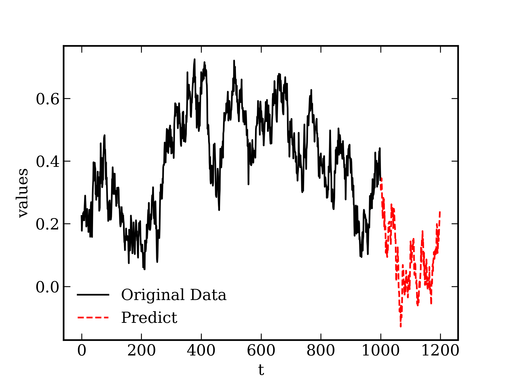

# Previsão de Séries Temporais com o Processo de Ornstein-Uhlenbeck

Este documento descreve o método implementado no script para modelar, calibrar e prever séries temporais utilizando o Processo de Ornstein-Uhlenbeck (OU). O código realiza a leitura de dados históricos, estima os parâmetros do modelo através de regressão linear (mapeamento AR(1)) e gera uma simulação futura.

---

## O Modelo Matemático

O Processo de Ornstein-Uhlenbeck é um processo estocástico que descreve o comportamento de reversão à média. Ele é frequentemente utilizado em finanças (para modelar taxas de juros ou volatilidade) e na física.

A equação diferencial estocástica (SDE) contínua que define o processo é:

$$dx_t = \theta (\mu - x_t) dt + \sigma dW_t$$

Onde:
* **x_t**: O valor da variável no tempo *t*.
* **μ (mu)**: O nível de reversão à média (o valor de longo prazo em torno do qual o processo oscila).
* **θ (theta)**: A taxa de reversão à média (a velocidade com que o processo retorna à média).
* **σ (sigma)**: A volatilidade ou magnitude do ruído.
* **dW_t**: O incremento de um processo de Wiener (Movimento Browniano padrão).

Na versão discreta (método de Euler-Maruyama) assumindo um passo de tempo constante de 1, a equação se torna:

$$x_{t+1} = x_t + \theta(\mu - x_t) + \sigma \epsilon_t$$

Onde $\epsilon_t$ é um ruído normalmente distribuído com média 0 e variância 1.

---

## Método de Estimação de Parâmetros

O código utiliza um método empírico baseado na relação do processo OU discreto com um modelo auto-regressivo de ordem 1, ou AR(1). A relação linear é definida como:

$$x_{t+1} = a x_t + b + \text{resíduo}$$

Os parâmetros são estimados da seguinte forma:

1. **Cálculo de 'a' e 'b'**: É feita uma regressão simples entre a série no tempo *t* (`x_t`) e no tempo *t+1* (`x_next`). 
   * `a` é calculado pela razão do produto cruzado das séries sobre a soma dos quadrados.
   * `b` é a média dos erros na previsão de transição.
2. **Derivação de θ (theta)**: Considerando a equação discreta, o fator que multiplica $x_t$ é $(1 - \theta)$. Portanto, $\theta = 1 - a$.
3. **Derivação de μ (mu)**: O termo constante na equação de regressão representa $\theta \times \mu$. Portanto, $\mu = b / \theta$.
4. **Derivação de σ (sigma)**: É o desvio padrão dos resíduos da regressão (a diferença entre os valores reais no passo *t+1* e os previstos pela reta de regressão).

---

## Estrutura do Código

O script é dividido nas seguintes etapas principais:

1. **Função `ou_forecast`**: Implementa a simulação iterativa do modelo de Euler-Maruyama para prever `N` passos no futuro, a partir de um valor inicial `x0`, aplicando ruído aleatório em cada passo.
2. **Leitura e Preparação**: Os dados são carregados do arquivo `data.dat` usando o NumPy. Assume-se que a variável de interesse está na segunda coluna do arquivo.
3. **Calibração**: Separação da série em `x_t` e `x_next` para calcular `a`, `b` e extrair $\theta$, $\mu$ e $\sigma$.
4. **Previsão**: Utiliza o último valor real da série (`x[-1]`) como ponto de partida e simula um cenário futuro cujo tamanho é igual à extensão original dos dados históricos.
5. **Visualização**: Utiliza a biblioteca Matplotlib para traçar um gráfico comparativo, exibindo os dados originais (em preto) e o cenário projetado a partir do último ponto (em vermelho).

---
## Resultado

O código gera previsões diferentes sobre a série temporal anterior. A quantidade de passos desejados previstos no futuro pode ter sua predição precisa ou não.

  

---

## Requisitos e Execução

Para executar este script, as seguintes bibliotecas Python são necessárias:
* `numpy`
* `matplotlib`

---
